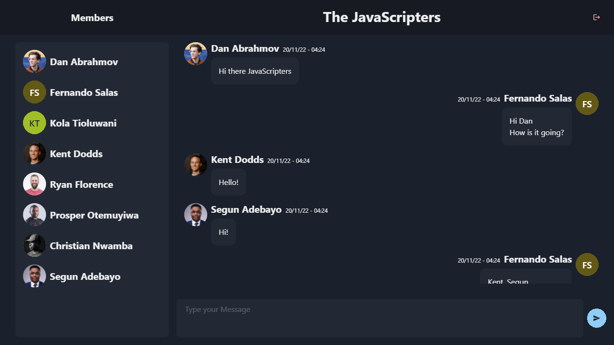
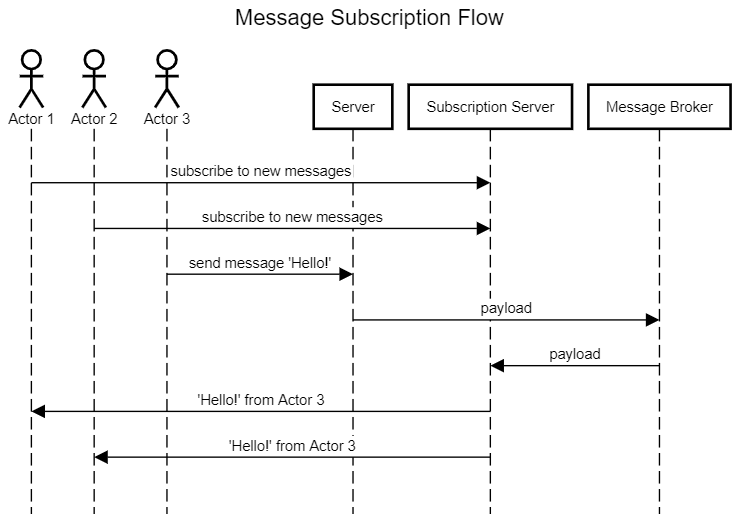

# Design and Development of Room Chat App

## Overview

Room Chat App is a Web App that allows you to comunicate with other users through rooms, in order to start using the app you must be Signed in, this can be done using your Google Account, once you're Signed in you can create rooms or join them using an invitation code, you can see all members of a room you are in, to start chatting with other users you must connect to the room, once in the room you can send a message and all the members will receive it and vice versa, you can also see older messages in the room, if you don't want to be in a room you can leave it, if the admin leaves the room, the latest user that joined the room will become the admin or the room will be deleted if there is no one else.

## Expected Features

- Sign up with Google
- Create room (you get an invitation code to share with others users)
- Join room by invitation code
- List all rooms I am in
- List all users in a room
- Send and receive messages in a room
- Load old messages in a room
- Leave room

## User Interface

I've come up with three different pages that represents the state of the app.

### Auth Page - Allows the user to authenticate

---

### Main Page - Once authenticated the user can

- Create Rooms
- Join Rooms
- See Rooms it belongs
- Connect to Rooms
- Leave Rooms
- Log out

---

### Room Page - Once connected to a room the user can

- Send Messages
- Receive Messages
- See old Messages
- See room Members
- Disconnect from the Room

---

## Authentication

In order to authenticate with google, I'll use [React Google Login](https://github.com/anthonyjgrove/react-google-login) to abstract the oAuth flow and get a `tokenId` then send it to the server and receive an `accessToken` in a cookie. Once I have the accessToken I can authenticate to the server by sending it in the `Authorization` header.

## Real Time Architecture

In order to achieve the real time features, I'm going to implement a [Publish–subscribe pattern](https://en.wikipedia.org/wiki/Publish%E2%80%93subscribe_pattern) using GraphQL Subscriptions.

